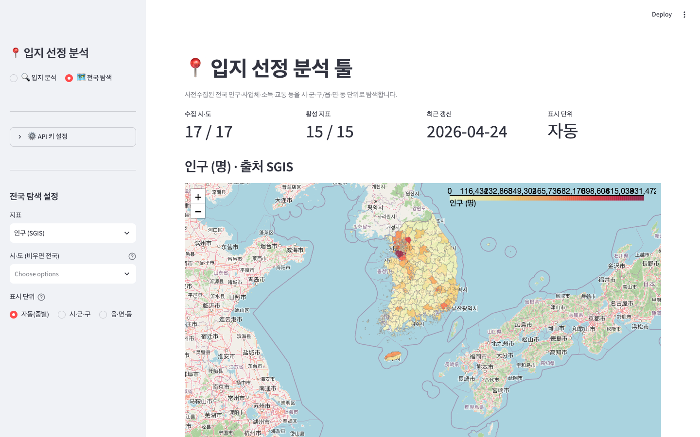
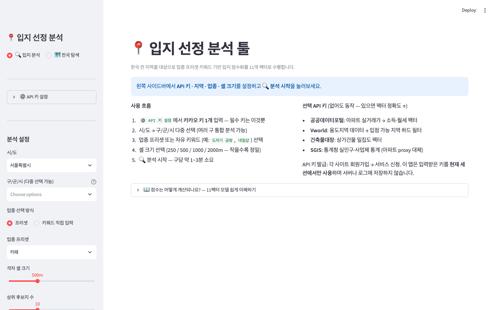

# 📍 Location Intelligence — 데이터 기반 입지 선정 분석 툴


[](https://locint51.streamlit.app/)

> "감으로 정하던 창업 입지를, **11개 공간 팩터의 점수 모델**로 객관화한다."

## 📸 화면

| 전국 탐색 — 인구·사업체·소득 choropleth (API 키 불필요) | 입지 분석 — 11팩터 점수화 랜딩 |
|---|---|
|  |  |

소상공인·사업 기획자가 최적 입지를 데이터로 선정하도록 돕는 Streamlit 앱입니다.
전국을 250m~2km 격자로 나누고, 공공·상용 API에서 수집한 데이터를 업종별 가중치로
점수화하여 **후보지 순위 + 근거**를 제시합니다.

```
좋은 입지 = 수요(인구·유동·직장) ↑ + 경쟁 ↓(또는 집적 ↑) + 접근성 ↑ − 비용(임대) ↓
Score = Σ (팩터 정규화 점수 × 업종별 가중치)  ×  용도지역 하드 필터
```

## 🎬 데모

- **전국 탐색 모드**: API 키 없이 바로 사용 — 사전수집된 전국 인구·사업체·소득·월세를
  시·군·구/읍·면·동 choropleth로 탐색
- **입지 분석 모드**: `🎬 데모 결과 바로 보기` 버튼으로 API 키 없이 전체 분석 결과
  (지도·후보지 순위·레이더 차트·상세 테이블) 체험 가능

직접 분석하려면 카카오 REST API 키(필수) + 선택 키(공공데이터포털·Vworld·건축물대장·SGIS)를
사이드바에 입력하고 지역·업종을 골라 `🔍 분석 시작` — 구당 1~3분.

## 🧮 11팩터 점수 모델

| 팩터 | 데이터 출처 | 팩터 | 데이터 출처 |
|---|---|---|---|
| 👥 인구 (타겟 연령 가중) | SGIS 통계청 | 🏪 업종 다양성 | 카카오 로컬 |
| 🚶 유동 (교통 밀도 기반) | 카카오 로컬 | 💰 소득 | 실거래가 (data.go.kr) |
| 💼 직장 (사업체·종사자) | SGIS | 🏠 임대 시세 | data.go.kr |
| ⚔️ 경쟁 (3모드 해석) | 카카오 키워드 | 🏢 상가 밀집 | 건축물대장 |
| 🚇 접근성 | 카카오 로컬 | 🛣️ 도로 품질 | Vworld |
| 🅿️ 주차 | 카카오 로컬 | | |

**설계 차별점**
- **경쟁 팩터 3모드**: 업종에 따라 경쟁이 독(세탁소→회피형)일 수도, 약(카페→집적형)일 수도
  있음을 모델에 반영. 프리셋에 없는 업종은 키워드를 규칙/AI(Claude)로 자동 분류
- **용도지역 하드 필터**: 법적 입점 불가 지역(전용주거·녹지)은 점수 무관 0점 — "점수는
  높은데 열 수 없는 자리" 원천 배제
- **타겟 인구 가중**: 키즈카페(유소년+부모), 실버 업종(고령) 등 연령대별 수요 보정

## 🏗️ 아키텍처

```
공공·상용 API (카카오/SGIS/data.go.kr/Vworld/건축물대장)
  → 수집 (collector, 병렬·캐시·쿼터 가드)
  → 격자화 (grid, 250m~2km) → 팩터 산출 → 정규화 → 업종 가중합 (scoring, 11팩터)
  → 클러스터링·경쟁 공백 탐지 (cluster) → folium 지도 + 차트 (visualizer)
  → Streamlit UI (데모 모드 / 세션별 API 키 격리 / 전국 탐색 choropleth)
```

- `app_Ver5.1.py` — 메인 앱 (입지 분석 + 전국 탐색 2모드)
- `src/` — collector, grid, scoring, cluster, visualizer, 각 API 클라이언트,
  demo_bundle(데모 저장/복원), explanations(앱 내 방법론 설명)
- `scripts/collect_*.py` — 전국 데이터 사전수집 (parquet, git 포함 20MB)
- `presets/` — 업종별 가중치 프로파일 (YAML)

## 🚀 실행

```bash
python -m venv .venv && source .venv/bin/activate   # Windows: .venv\Scripts\activate
pip install -r requirements.txt
streamlit run app_Ver5.1.py
```

> macOS 13 이하에서 pyproj wheel이 없어 빌드 오류가 나면:
> `brew install proj` 후 `PROJ_DIR=/opt/homebrew/opt/proj pip install -r requirements.txt`

배포: Streamlit Cloud (git push 시 자동 반영). API 키는 세션 단위로만 사용하며
서버에 저장하지 않음 (`src/session_keys.py` — 다중 사용자 세션 격리).

## 🧭 엔지니어링 노트

- **API 쿼터·비용 가드**: 분석 범위(구 수 × 셀 크기)로 호출량을 사전 추정해 상한 제한
- **성능**: 전국 데이터는 사전수집 parquet로 오프로드, 세션 캐시로 재분석 방지
- **신뢰성**: 단계별 진행 표시(st.status) + 오류 원인 힌트(401/timeout/429 등 맥락별)
- **한계 명시**: 점수는 분석 범위 내 상대 평가 — 앱 내 방법론 설명에 한계를 정직하게 기재

## 🔭 확장 방향

현재 가중치는 업종 일반론 기반의 **휴리스틱**입니다. 실제 성과 데이터(매출, 폐업률,
분양률 등)가 확보되면 가중치를 **지도학습으로 대체**하고 SHAP으로 "왜 이 입지가
고평가됐는지"를 설명하는 구조로 발전 가능합니다 — 예: 건설·부동산 도메인의
**분양성 평가 모델**(수요·경쟁·접근성 팩터 구조가 동일)로의 전이.
